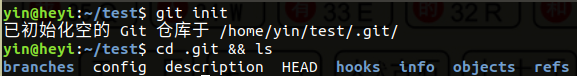

# 深入了解git内部原理笔记

> 作者：殷和义
> 日期：2020年5月29日

----

目录：

[TOC]

----

## git的的上层命令与底层命令

git 本质上是一个内容寻地址文件系统. 平时使用git工具时，常使用的例如 `git add`/ `git commit` / `git branch` / `git checkout` / `git remote`等指令对使用者很友好，它们算是git上层的指令.
git 还包含了一部分用于完成底层工作的子命令。 这些命令被设计成能以 UNIX 命令行的风格连接在一起或由脚本调用来完成工作, 这部分命令一般被称作“底层（plumbing）”命令. 底层命令可以窥探 Git 内部的工作机制，也有助于说明 Git 是如何完成工作的，以及它为何如此运作。

## .git目录

众所周知, 使用 `git init` 命令可以初始化一个git 仓库. 更深入一步的讲，git会创建一个.git 目录: 这个目录包含了几乎所有 Git 存储和操作的东西。 如若想备份或复制一个版本库，只需把这个目录拷贝至另一处就可以。 

先看看 `git init`命令之后，它创建了什么：

- banches目录: 新版本的git 已经不使用该目录了，所以它基本都是空的，不需要管。
- config文件：它包含了只针对当前仓库的生效的配置文件。
- description文件: 仓库的描述信息, GitWeb会读取它.
- **HEAD文件:** 它里面保存了当前checkout出的分支信息，例如：`ref: refs/heads/master`, 表示当前所在的分支为master.
- hooks目录：包含客户端或服务端的钩子脚本.
- info目录：该目录下有一个exclude文件，用以放置那些不希望被记录在 .gitignore 文件中的忽略模式.
- **objects目录:**用于存储所有的数据内容。
- **refs目录:** 该目录下通常会有三个子目录 heads/remotes/tags, 里面分别包含了分支/远程分支/标签指向的提交对象的hash值。
- logs目录：历史提交记录信息。
- **index:** 它保存了当前有add进来的文件信息，该信息是累加的. 例如：第一次add了1.c文件然后commit了，接下又add了2.c文件，那么当前index中就保存了1.c与2.c文件的信息。 可以使用命令 `git ls-files --stage` 显示index文件的内容。 刚初始化的git仓库不存在该文件，只有当执行了`git add` 之后才会创建。

## Git对象

