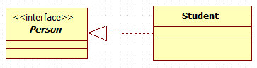
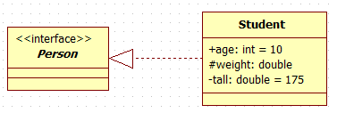
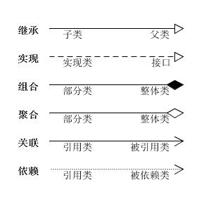
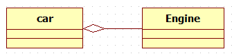
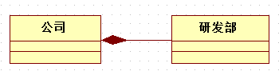
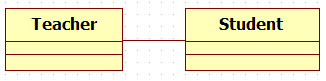
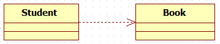

# UML类图介绍

## 一.类图的组件

普通类有3个组件：类名/属性/方法， 接口类有2个组件：类名/方法。

### 1.类名

接口类的类名会使用斜体表示(有的加上<<Interface>>的字样)，普通类的类名使用普通字体表示。

### 2.属性

属性就是指类的成员变量，定义格式为： `可见性指示符 名称 : 类型 [=缺省值]`. 可见性指示符表示如下：

> - \+ : 表示公有(Public)
> - \- : 表示私有(private)
> - \# : 表示保护(protected)

### 3.方法

方法就是指类的成员函数，定义格式为： `可见性指示符 名称(参数列表) : 返回值类型 `.

## 二.类与类之间的关系

常见有六种关系,分别为：泛化(Generalization)，实现(Realization), 聚合(Aggregation), 组合(Composition), 关联(Association), 和依赖(Dependency). 

### 1.泛化关系

泛化关系就是继承关系，子类继承父类。使用带三角箭头的实线表示, 箭头指向父类。

### 2.实现关系

实现关系为子类与接口类的关系。 使用带三角箭头的虚线表示，箭头指向接口类。

### 3.聚合关系

"has a"的关系，部分可以离开整体而存在。 使用带空心菱形的实线表示，菱形指向整体。

### 4.组合关系

"contains a"的关系，部分不能离开整体而存在。 使用带实心菱形的实线表示，菱形指向整体。

### 5.关联关系

用于表示一个类与另一个类有关联关系, 例如学生与老师，父母与孩子等。使用带普通箭头的实线表示, 箭头指向被动的一方。

### 6.依赖关系

经常在需要表示一个事物使用另一个事物时使用依赖关系。使用带普通箭头的虚线表示, 箭头指向被依赖的一方。

## 三.全景图

**参考资料：**
1. [http://uml.org.cn/oobject/201104212.asp?artid=#](http://uml.org.cn/oobject/201104212.asp?artid=#)
2. [https://www.awaimai.com/patterns/uml](https://www.awaimai.com/patterns/uml)
